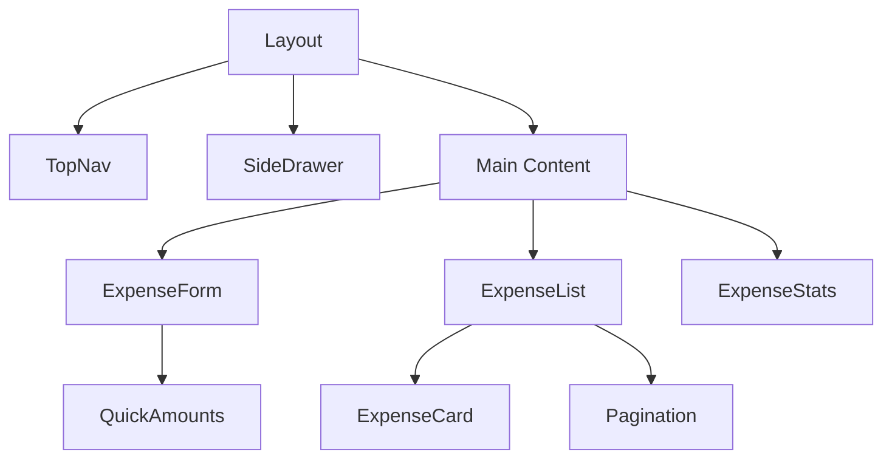
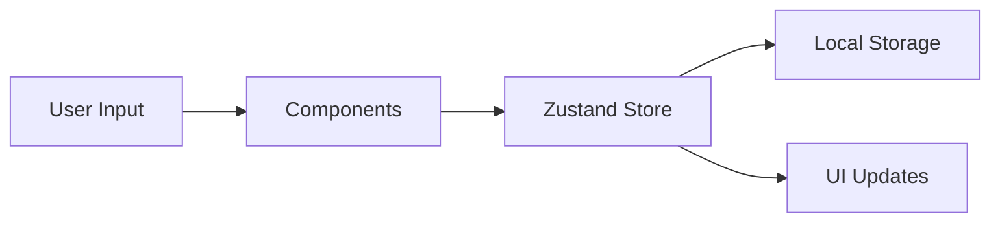

# 💰 Modern Expense Tracker

A modern, feature-rich expense tracking application built with Next.js 14 and TypeScript. Track your daily expenses, view statistics, and manage your spending with an intuitive user interface.

## 🌟 Features & Functionality

### Core Features
- **💳 Expense Management**
  - Quick and easy expense entry
  - Customizable quick-add amount buttons
  - Category-based expense tracking
  - Description and date tracking

- **📊 Statistics & Analysis**
  - Total expenses overview
  - Category-wise spending analysis
  - Date range based filtering
  - Export data to CSV

- **⚙️ Customization**
  - Currency settings (symbol & position)
  - Custom categories with emojis
  - Configurable quick-add amounts
  - Dark/Light theme support

### User Experience
- 📱 Responsive design for all devices
- 🎨 Clean, modern interface
- 🌓 Theme customization
- ⚡ Fast and intuitive navigation

## 🛠️ Technical Architecture

### Technology Stack
- **Framework**: Next.js 14 (App Router)
- **Language**: TypeScript
- **State Management**: Zustand
- **Styling**: Tailwind CSS
- **UI Components**: Headless UI
- **Data Persistence**: Local Storage

### Project Structure
```
app/
├── components/           # UI Components
│   ├── expenses/        # Expense-related components
│   ├── settings/        # Settings components
│   └── ui/             # Shared UI components
├── constants/           # Application constants
├── contexts/           # React contexts
├── hooks/              # Custom React hooks
├── services/           # API services
├── store/             # Zustand stores
├── types/             # TypeScript types
└── utils/             # Utility functions
```

### Component Architecture


### State Management
- **Zustand Stores**:
  - `useStore`: Main application state
  - `currencyStore`: Currency settings
  - `ThemeContext`: Theme preferences

### Data Flow


## 🚀 Getting Started

### Prerequisites
- Node.js 16.x or later
- npm or yarn

### Installation
```bash
# Clone the repository
git clone https://github.com/yourusername/expense-tracker.git

# Install dependencies
npm install

# Start development server
npm run dev
```

## 💡 Key Features Explained

### Expense Management
- **Quick Add**: Customizable quick-add buttons for common amounts
- **Categories**: Customizable expense categories with emoji support
- **Filtering**: Date range based expense filtering
- **Export**: CSV export functionality

### Settings & Customization
- **Currency**: Configure symbol and position
- **Categories**: Add, remove, or disable categories
- **Quick Amounts**: Configure quick-add amount buttons
- **Theme**: Toggle between light and dark themes

### Statistics
- View total expenses
- Track average spending
- Identify top spending categories
- Analyze spending patterns

## 🎨 UI/UX Features

### Responsive Design
- Mobile-first approach
- Adaptive layouts
- Touch-friendly interfaces
- Smooth transitions

### Theme Support
- Light/Dark mode
- System preference detection
- Persistent theme selection
- Consistent styling

## 🔧 Configuration

### Environment Variables
```env
NEXT_PUBLIC_API_URL=your_api_url
```

### Default Settings
- Currency: USD ($)
- Theme: System preference
- Items per page: 10

## 🛠️ Development

### Available Commands
```bash
npm run dev      # Development server
npm run build    # Production build
npm start        # Start production server
npm run lint     # Run linting
```

## 🔜 Future Enhancements
- [ ] Backend integration
- [ ] User authentication
- [ ] Multi-currency support
- [ ] Data visualization
- [ ] Budget planning
- [ ] Receipt scanning
- [ ] Mobile app version

## 📄 License
This project is licensed under the MIT License.

## 🤝 Contributing
Contributions are welcome! Please read our contributing guidelines for details.

## 👥 Authors
- Your Name - Initial work - [GitHub](https://github.com/yourusername)
